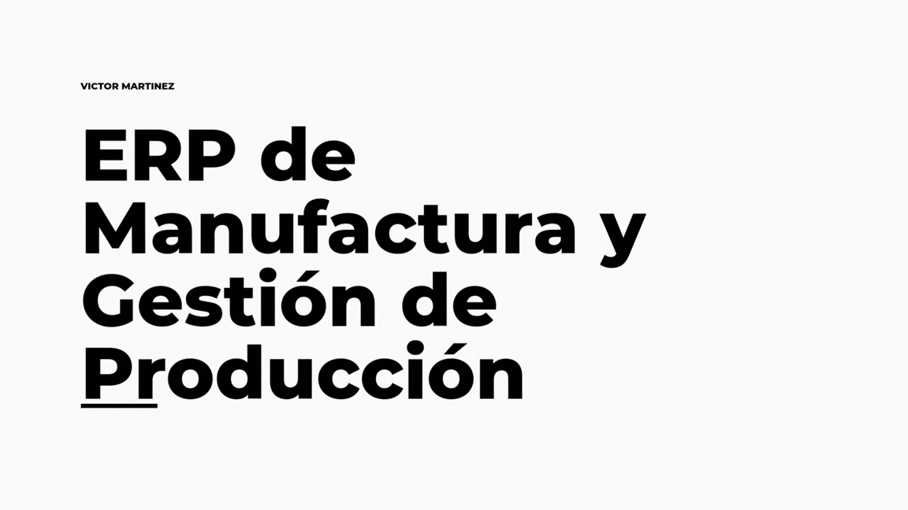

  <h1>Hi, I'm Victor Martínez</h1>
  <h3>Ingeniero en Informática | Full Stack Developer | AI Solutions</h3>
  
  
  

 

## Sobre mí

Soy un **Ingeniero en Informática** apasionado por la convergencia entre el desarrollo web moderno y la Inteligencia Artificial. Me especializo en construir sistemas **ERP, SaaS y soluciones a medida** que resuelven problemas reales de negocio.

Actualmente, me enfoco en:
* Desarrollo **Full Stack** (React, Next.js, Node.js).
* Integración de **Modelos de IA** y Agentes en flujos de trabajo productivos.
* Despliegue de infraestructura en la nube y servidores Linux.

---

## Stack Tecnológico

| Dominio | Tecnologías |
| :--- | :--- |
| **Frontend** |     |
| **Backend & IA** |     |
| **Database & Cloud** |    |

---

## Proyectos Destacados (Casos de Estudio)

A continuación presento soluciones desarrolladas para clientes reales.
*Nota: Debido a acuerdos de confidencialidad (NDA), el código fuente es privado. Se presentan demostraciones visuales y arquitectura.*

### TechMachineShop | ERP Industrial & Biometría
**Rol:** Líder de Sistemas & Full Stack Developer
**Estado:** Producción (Uso interno privado)

> **El Desafío:** Digitalizar una planta de manufactura, integrando control de asistencia facial y gestión de nómina compleja.

**Solución Técnica:**
* **Arquitectura:** Frontend en **Vite (React)** consumiendo una API **Python**.
* **IA & Seguridad:** Implementación de modelos de **Hugging Face** para reconocimiento facial in-situ (evitando costos de API nube) integrados a un sistema de control de acceso físico.
* **Infraestructura:** Servidor FTP local seguro para manejo de planos de ingeniería y despliegue en contenedores **Docker**.

---

### Solutions-Maple | Sistema de Gestión de Manufactura Electrónica
**Rol:** Full Stack Developer
**Estado:** Producción

> **El Desafío:** Orquestar el flujo de trabajo para diseño de componentes electrónicos, perfilado y grabado, asegurando trazabilidad para clientes de alto nivel.

**Solución Técnica:**
* **Serverless:** Arquitectura basada en **Firebase** (Auth, Firestore, Functions) para alta disponibilidad sin mantenimiento de servidores físicos.
* **Frontend:** **Next.js** para una interfaz rápida y responsiva en planta.
* **Datos:** Trazabilidad en tiempo real de las órdenes de manufactura y estados de producción de componentes.

---

### Plataforma Logística
Solución de agendamiento y optimización de rutas de recolección.
* **Tech:** Vite, Firebase.
* **Key:** Optimización logística y despliegue automatizado.
